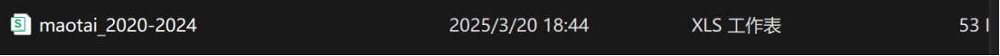
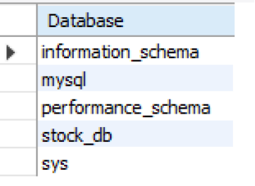
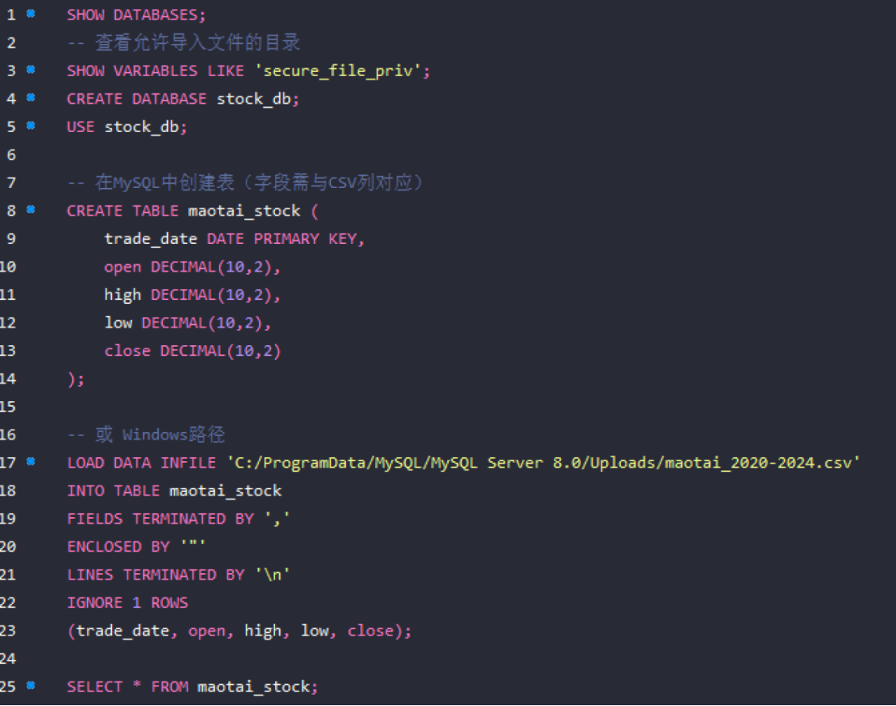
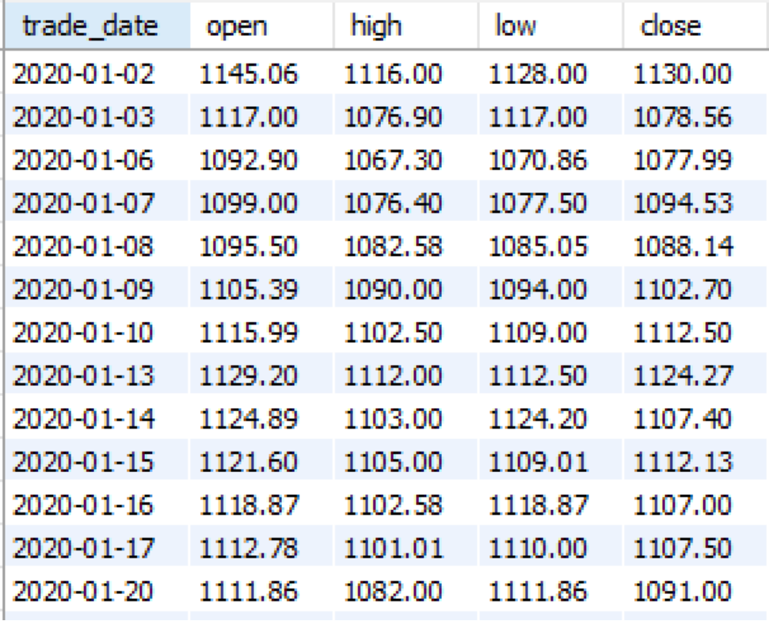
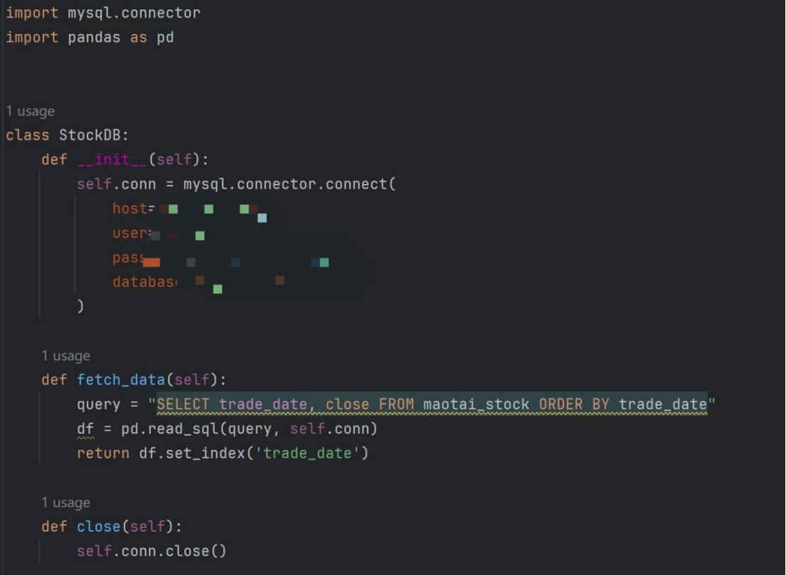
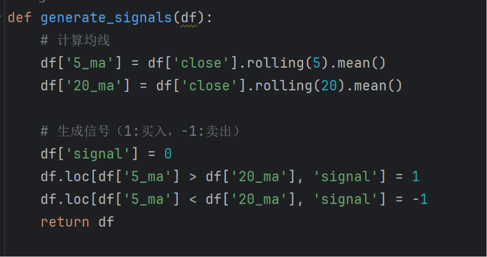
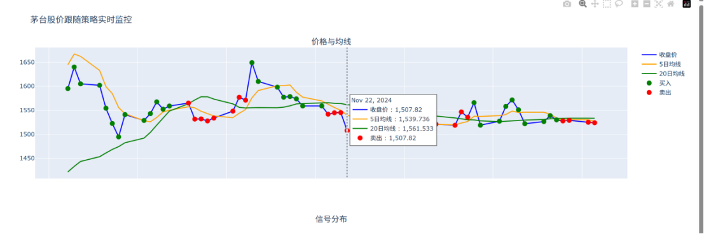
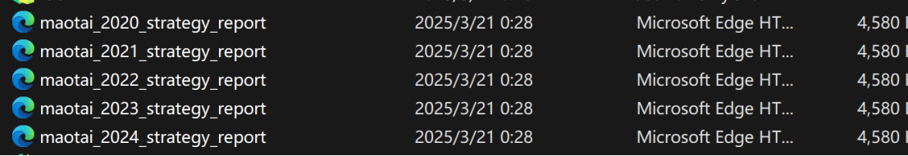
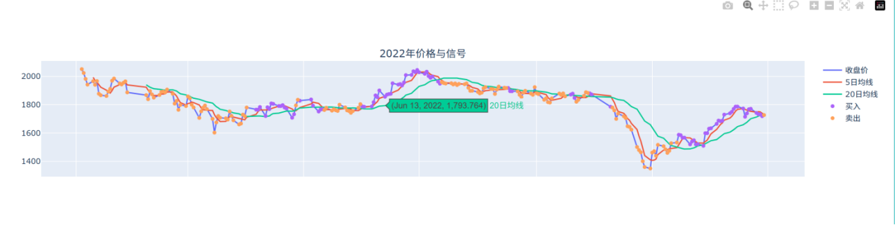

# Trending Strategy based on python & MySQL 
PS.[^1]
## 
 Lloyd 2024211330

### 1ST.Experiment Environment
1. **MySQL**
2. **Pycharm**
***
### 2ND.Tools
 - CSDN
 - Deepseek LLM   
 - (WindSurf is not available in my region.)
***
### 3RD.Data resources
 - *tushare data community*(https://tushare.pro/user/token)
 - 600519.GuiZhou Maotai Stock
 - 2020-01-01 ~ 2024-12-31
 - open/close/high/low
***
### 4TH.Steps
1. Find stock data resources from websites
2. Upload relevant data into MySQL
3.Connect MySQL to Pycharm
4. Implement trend following strategy in .py
5. Visualization
***
### STEP1 Get Data
1. Till now I only know how to webcrawl using MATLAB,haven't try python yet.
2. Many relevant websites set anti-crawl programs like 'cookies'.
3. Scheduled to use python lib - yfinance.But it doesn't work even with VPN.Searching for information and learn that it doesn't open to python services now.
4. Use open data resources in 'tushare' domestic.Sign & access to token,download relevant data into local .csv table with the assistance of python lib - tushare.
   
   
### STEP2 Upload to MySQL
1. Copy .csv to file C:/MySQL/Uploads for the upload of data.
2. Construct database & table in MySQL
   
   `use stock_db here`
   
   
   `successfully upload data`
### STEP3 Connection build

### STEP4 Trend following Strategy
1. Choose *5day-20day mean crossing strategy*.
i.e.
- *Buy in*: 5_ma > 20_ma
- *Sell out*: 5_ma<20_ma
- *5-day average*: reflect short period fluctuations,capture market's realtime mood
- *20-day average*: universal average for med-term trends
 
### STEP5 Visualization
1. Use python lib - matplotlib/plotly to visualize strategy in ports
   
2. Genearate 5 years visualization UI and save as .html
   
   
***

[^1]: Due to limited personal capability.The python codes in this method was mainly constructed by deepseek-r1.I do the rectification work.

